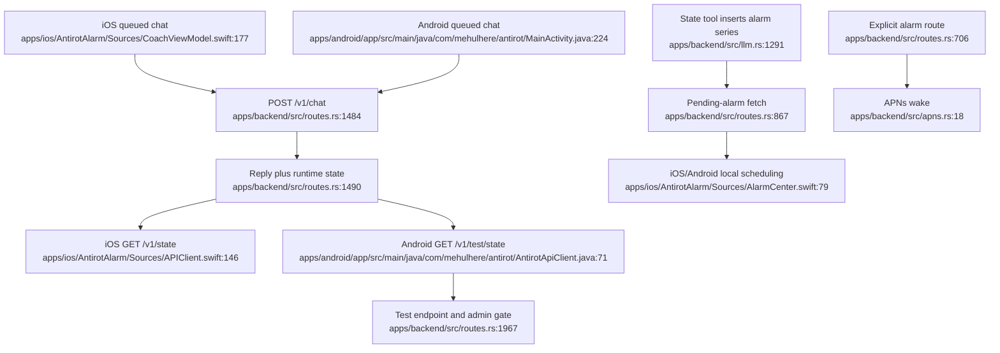

# Client and API delivery

The clients mix versioned and unversioned routes. Android depends on a production-disabled test endpoint, while the legacy tester infers state from markdown logs instead of the authoritative runtime-state API.
