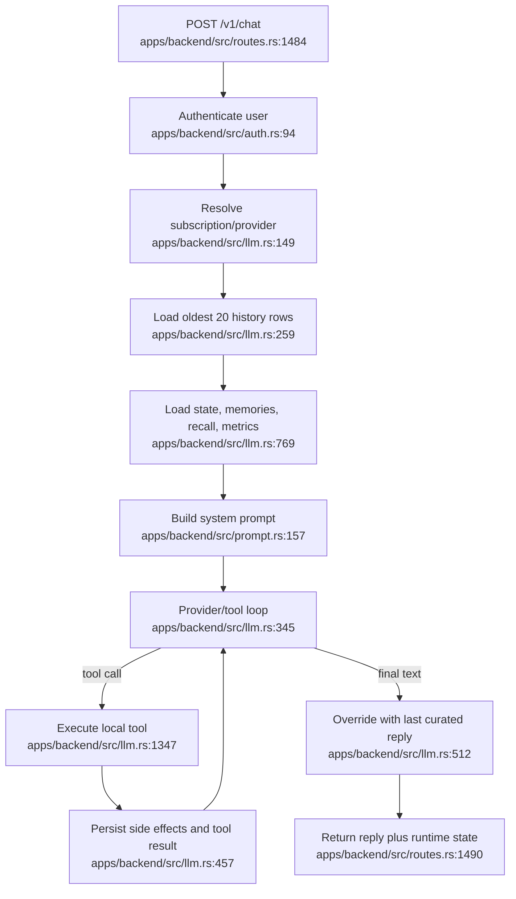

# Prompt and LLM orchestration

Key boundaries: PostgreSQL, Vertex/Gemini/OpenAI-compatible APIs, Gemini/Voyage embeddings, and alarm persistence. The visible reply can diverge from the persisted assistant reply at `apps/backend/src/llm.rs:431-516`.
