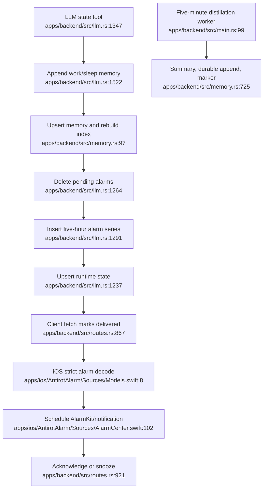

# Runtime state, memory, and alarms

The core write path is non-atomic across memory, alarms, and state. Pending delivery is at-most-once, and state-created series bypass the APNs path used at `apps/backend/src/routes.rs:706-865`.
