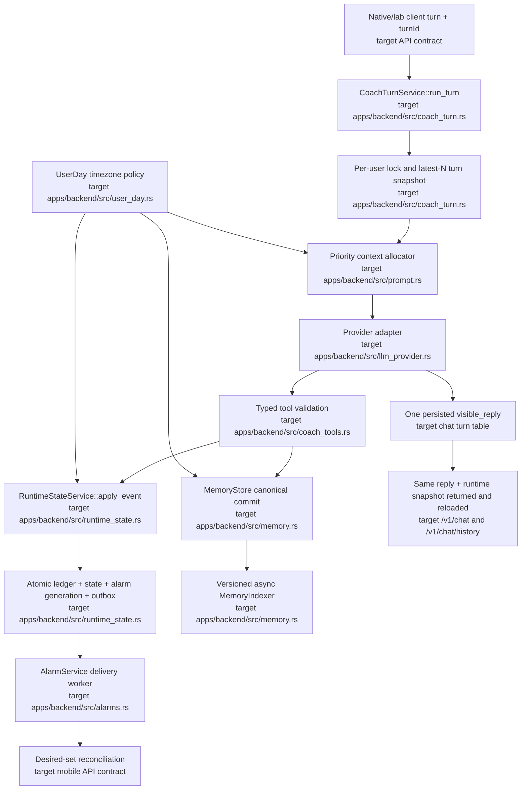

# Proposed Unified Architecture

## Verdict

The broad architecture is correct: native clients talk to one Rust backend; PostgreSQL owns durable state; the LLM chooses coaching actions; providers are backend-only. A rewrite is unnecessary. The problems are boundary consistency, transactional safety, and duplicated contracts.

## Highest-priority defects

### P0 — fix before further prompt tuning

1. **iOS rejects coach-generated alarm kinds.** Backend kinds at `apps/backend/src/llm.rs:1149-1225` do not match `apps/ios/AntirotAlarm/Sources/Models.swift:8-16`. Because fetch marks rows delivered first (`apps/backend/src/routes.rs:895-918`), a decode failure loses the batch.
   - Fix: one canonical alarm enum; tolerate unknown transport values; add a real series-payload contract test.

2. **State/alarm actions partially fail but report success.** `transition_user_state` is non-transactional (`apps/backend/src/llm.rs:1131-1261`) and returns failure as text; callers still prefix `Success:` (`apps/backend/src/llm.rs:1538-1702`).
   - Fix: typed `Result`, one database transaction for ledger/state/alarm generation, and no success copy until commit.

3. **Alarm delivery is at-most-once and acknowledgement cannot cancel fetched siblings.** Fetch terminally marks up to 50 rows delivered (`apps/backend/src/routes.rs:867-918`), while ack deletes only pending siblings (`apps/backend/src/routes.rs:1006-1019`). Already scheduled escalation alarms can continue for hours.
   - Fix: series IDs, leases, bulk schedule confirmation, cancellation tombstones, and client reconciliation.

4. **Coach-created alarms bypass APNs and normal clients do not reconcile after chat.** State series insert directly at `apps/backend/src/llm.rs:1291-1345`; APNs exists only on the explicit route at `apps/backend/src/routes.rs:706-865`.
   - Fix: one alarm service plus transactional outbox; foreground clients reconcile immediately after state-changing responses.

5. **Bare `Done.` can end the session while the reply says it remains active.** Prompt rule: `apps/backend/src/prompt.rs:209`; zero-minute transition: `apps/backend/src/llm.rs:1548-1574`; contradictory reply: `apps/backend/src/llm.rs:573`.
   - Fix: reject missing/non-positive actual minutes before any side effect and require `working` in the regression case.

6. **Snapshot restore can partially erase memory and resurrect stale recall.** Restore deletes and rebuilds without a transaction (`apps/backend/src/memory.rs:200-275`); chunks have no canonical-memory foreign key (`apps/backend/sql/001_init.sql:220-233`).
   - Fix: transactional canonical restore with versioned asynchronous reindex; restore runtime through the same transition/reconciliation path.

### P1 — next stabilization pass

1. **History selects the oldest messages.** `ORDER BY created_at ASC LIMIT 20/100` at `apps/backend/src/llm.rs:259-275` and `apps/backend/src/routes.rs:1506-1520` freezes long conversations near their beginning.
   - Fix: newest-N descending subquery, then ascending presentation with `(created_at,id)` ordering.

2. **Visible and persisted conversations diverge.** Model text is stored at `apps/backend/src/llm.rs:431-444`; curated text replaces it only in the response at `apps/backend/src/llm.rs:471-516`.
   - Fix: internal turn events plus one committed `visible_reply` used by response, history, and future context.

3. **Writable memory is injected with system-role authority.** Client-updatable content (`apps/backend/src/routes.rs:1378-1398`) is concatenated raw into the system message (`apps/backend/src/prompt.rs:304-330`).
   - Fix: delimit memory as untrusted evidence, prohibit instructions inside it, and represent core state as typed data.

4. **Malformed tool calls trigger default real actions.** JSON parse/default behavior at `apps/backend/src/llm.rs:1347-1355,1437-1675` can start/end work or sleep from missing fields.
   - Fix: strict typed arguments, schema bounds, and zero side effects on invalid input.

5. **Concurrent turns can overwrite each other.** `/chat` has no per-user serialization/idempotency at `apps/backend/src/routes.rs:1484-1497`.
   - Fix: client turn ID plus PostgreSQL advisory lock or turn row.

6. **Android production state is wired to an admin-only test endpoint.** Client: `apps/android/app/src/main/java/com/mehulhere/antirot/AntirotApiClient.java:71-77`; gate: `apps/backend/src/routes.rs:1967-1976,2256-2267`.
   - Fix: use `/v1/state` and the state already returned by chat.

7. **Memory indexing is synchronous, non-atomic, and repeatedly re-embeds multi-chunk documents.** Canonical write then derived index: `apps/backend/src/memory.rs:97-117,935-1007`; incorrect document-vs-chunk hash check: `apps/backend/src/memory.rs:896-930`.
   - Fix: canonical commit plus outbox job, document version hash, build/swap index generations, bounded provider timeouts.

8. **User-day logic is UTC/IST-specific and distillation is race-prone.** Time: `apps/backend/src/llm.rs:1057-1066`; distillation: `apps/backend/src/memory.rs:566-815`.
   - Fix: persist IANA timezone, central `UserDay`, advisory lock, and transactionally commit summary/durable/marker for the completed behavioral day.

### P2 — maintainability and quality

- Compress the 20,959-byte static prompt and place safety/product boundaries above style (`apps/backend/src/prompt.rs:157-301`). Use a short invariant core plus runtime-mode fragments.
- Guarantee budget for runtime/current-task/today-log before archives (`apps/backend/src/llm.rs:825-922`, `apps/backend/src/prompt.rs:311-340`).
- Replace hidden prose onboarding with a typed profile endpoint; currently the early return can discard name/timezone (`apps/backend/src/llm.rs:200-202`).
- Add chat size/rate/concurrency limits at `apps/backend/src/routes.rs:1484-1497`.
- Make provider loop exhaustion and malformed response shapes explicit failures (`apps/backend/src/llm.rs:359-516`).
- Correct sleep metrics with completed-sleep counts and circular time-of-day averaging (`apps/backend/src/memory.rs:431-517`).
- Migrate all clients to `/v1`; retire the legacy tester or make it a thin production-contract client.

## Target components

1. `CoachTurnService::run_turn` — validates/idempotently serializes a turn, builds prioritized context, calls one provider adapter, validates typed tools, and persists one visible reply.
2. `RuntimeStateService::apply_event` — the only state-changing entry point; transactionally writes ledger, state, alarm generation, and outbox.
3. `AlarmService::reconcile` — owns canonical alarm kinds, series/generation identity, leases, confirmations, cancellation tombstones, and APNs/FCM outbox.
4. `MemoryStore` plus `MemoryIndexer` — canonical memory commits synchronously; derived index builds asynchronously by version.
5. `UserDay` — one user-timezone/day-boundary policy for logs, stats, prompt context, and distillation.

## Expected capability impact

- No intended product capability is removed.
- Legacy unversioned routes and the static tester should remain only for a measured migration window.
- Alarm delivery changes from fire-and-forget rows to a reconciled desired-state model.
- Memory search may be briefly one version behind after a write, but canonical memory becomes reliable and chat latency improves.
